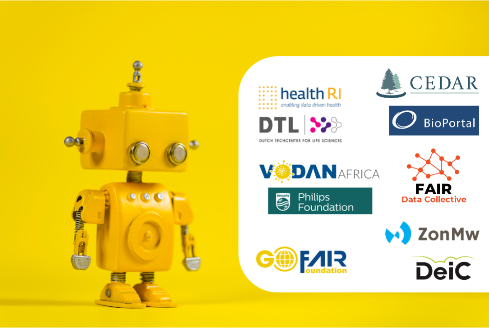
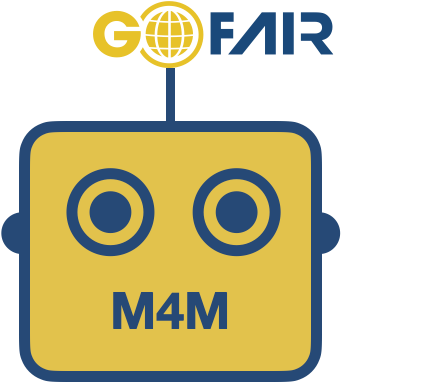
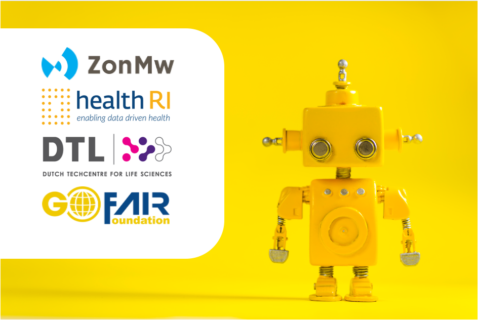

# [Welcome to the Metadata for Machines resource page]{style="color: Gold;"}

# The M4M Workshop concept

## Making it easy for humans to make metadata for machines

::: {layout-ncol=2}

Metadata for Machines (M4M) workshops are agile, hackathon-style events that bring together domain experts (who are able and willing to represent a domain community) with FAIR metadata experts (data stewards) who guide a discussion leading to the metadata requirements that meet the FAIR data needs of that domain community. M4M Workshops are lightweight, fast-track (often 1-day) events where policy and domain experts can build new, or make informed choices regarding the reuse of already existing metadata schema. Although M4M Workshops can serve many purposes, they are usually intended to kick-start FAIRification efforts with minimally viable metadata components that are modular, and can be later extended as needed.

:::

#### *M4M Worskhops have two objectives:*

1. First, most M4M Workshops focus on a simple but extensible conceptual model and RDF schema that solve clearly identified FAIR-related metadata goals for that domain. Based on numerous considerations, the metadata expert will recommend if a new schema should be created or if an existing schema can be efficiently repurposed. In most cases, it is also possible to employ metadata modeling tools to build reusable metadata templates following that schema providing user-friendly interfaces and input forms. This will later allow domain experts who may not have technical skills, to nonetheless create metadata instances without expert supervision.

2. The second objective of a M4M Workshop is the deposition of the defined metadata schema/template into a FAIR repository, where they can be easily found and reused by other communities that often have similar metadata requirements. The overall goal of a M4M Workshop is a public Declaration by the domain community to the use and reuse of particular FAIR metadata schema/templates. This declaration could take the form of a FAIR Implementation Profile or a statement in a Data Management Plan.

M4M Workshops draw on the deep knowledge collected in many scientific communities but also ensure coordination with the metadata components chosen in other M4M workshops. Collectively, the M4M workshop series result in recommendations about metadata and an Open repository of machine-ready, easy to use and interoperable FAIR metadata templates and components. Anyone can access this ’sea’ of community specific metadata templates/components, re-use them as they see fit, and deploy them using metadata editors and other data capture tools.

It is hoped that the M4M workshop can allow researchers to make routine use of machine-actionable FAIR metadata in a broad range of fields.

## How to GO FAIR
The Three-point FAIRification Framework provides practical “how to” guidance to stakeholders seeking to go FAIR. More information on how the M4M fits into this framework can be found on the [GO FAIR website](https://www.go-fair.org/how-to-go-fair/).

## FAQ
Should you have any questions about M4M workshops, please consult the [Frequently Asked Questions](https://docs.google.com/document/d/1XBUsLeX8SEBamsd-km0G-FKXDQQw79DBr4K5GWmNz9I/edit?tab=t.0#heading=h.ovxsov5fskcp).

##ZonMw and FAIR metadata

## M4M workshops for the ZonMw
Within the ZonMw COVID Program, data stewards have participated in a series of M4M Workshops on behalf of the COVID Program researchers. The data stewards have been guided by the M4M Facilitator Team (John Graybeal, Barbara Magagna, Kristina Hettne, Nikola Vasiljevic and Erik Schultes) and supported by a team of experts: Margreet Bloemers (ZonMw), Mijke Jetten (DTL/Health-RI), Jeroen Beliën (Amsterdam UMC, loc. VUmc), Rita Azevedo (Lygature/Health-RI), Erik Schultes (GO FAIR Foundation).

## Metadata Forms for Datasets
**Guidelines for dataset metadata forms**

[Link to the guidelines document](https://osf.io/2y6ba/)

**CEDAR forms** [forms to fill out, CEDAR account required]

[Dataset Catalogue form](https://cedar.metadatacenter.org/instances/create/https://repo.metadatacenter.org/templates/28d58a30-1a42-4715-a742-d2f46690563e?folderId=https:%2F%2Frepo.metadatacenter.org%2Ffolders%2Fd43fd5ed-863a-4588-ba7e-02257d96c76a)

[Dataset form](https://cedar.metadatacenter.org/instances/create/https://repo.metadatacenter.org/templates/de169781-7f75-4aef-a0cb-ac435fe3a4c7?folderId=https:%2F%2Frepo.metadatacenter.org%2Ffolders%2Fd43fd5ed-863a-4588-ba7e-02257d96c76a)

[Dataset Distribution form](https://cedar.metadatacenter.org/instances/create/https://repo.metadatacenter.org/templates/22925909-9fb2-4ac8-a986-6db5ae7049e7?folderId=https:%2F%2Frepo.metadatacenter.org%2Ffolders%2Fd43fd5ed-863a-4588-ba7e-02257d96c76a)

**CEDAR forms in OpenView** [forms to view/share, no CEDAR account required]

[Dataset Catalogue form in OpenView](https://openview.metadatacenter.org/templates/https:%2F%2Frepo.metadatacenter.org%2Ftemplates%2F28d58a30-1a42-4715-a742-d2f46690563e)

[Dataset form in OpenView](https://openview.metadatacenter.org/templates/https:%2F%2Frepo.metadatacenter.org%2Ftemplates%2Fde169781-7f75-4aef-a0cb-ac435fe3a4c7)

[Dataset Distribution form in OpenView](https://openview.metadatacenter.org/templates/https:%2F%2Frepo.metadatacenter.org%2Ftemplates%2F22925909-9fb2-4ac8-a986-6db5ae7049e7)

## Metadata Forms for ZonMw COVID-19 Community

**Guidelines for completing CEDAR forms**

[Link to the guidelines document](https://osf.io/at759/)

**CEDAR forms** [forms to fill out, CEDAR account required]

[Project Admin form](https://cedar.metadatacenter.org/instances/create/https:/repo.metadatacenter.org/templates/337cb6f3-eef6-4b2f-9ffb-3f6d6cc9b9ac?folderId=https:%2F%2Frepo.metadatacenter.org%2Ffolders%2F04ac2b48-0ab2-42bf-9f27-db03facbf9f1)

[Project Content form](https://cedar.metadatacenter.org/instances/create/https:/repo.metadatacenter.org/templates/908e33e2-9485-4a93-ab22-1688dc5819dc?folderId=https:%2F%2Frepo.metadatacenter.org%2Ffolders%2F82d8ec55-de6a-48d9-82c1-cdf64b568e7c)

**CEDAR forms in OpenView** [forms to view/share, no CEDAR account required]

[Project Admin form in OpenView](https://openview.metadatacenter.org/templates/https:%2F%2Frepo.metadatacenter.org%2Ftemplates%2F337cb6f3-eef6-4b2f-9ffb-3f6d6cc9b9ac)

[Project Content form in OPenView](https://openview.metadatacenter.org/templates/https:%2F%2Frepo.metadatacenter.org%2Ftemplates%2F908e33e2-9485-4a93-ab22-1688dc5819dc)

**BioPortal vocabularies**

[ZonMw Generic Terms](https://bioportal.bioontology.org/ontologies/ZONMW-GENERIC)
[ZonMw COVID-19 Vocbulary](https://bioportal.bioontology.org/ontologies/ZONMW-CONTENT)

## Metadata Forms for ZonMw ID & AMR Community

**Guidelines for completing CEDAR forms**

[Link to the guidelines document](https://mfr.osf.io/render?url=https://osf.io/8gm4n/?direct%26mode=render%26action=download%26mode=render)

**CEDAR forms** [forms to fill out, CEDAR account required]

[Project Admin form](https://cedar.metadatacenter.org/instances/create/https://repo.metadatacenter.org/templates/4e6fd7e8-0d28-4715-9908-08ba4263c0f3?folderId=https:%2F%2Frepo.metadatacenter.org%2Ffolders%2F9c36659c-7f64-425c-944e-199adba856a4)

[Project Content form](https://cedar.metadatacenter.org/instances/create/https:/repo.metadatacenter.org/templates/57ea8ca1-8ef6-4168-8842-945a1e6fd12e?folderId=https:%2F%2Frepo.metadatacenter.org%2Ffolders%2Fa7bb89a9-3dde-4955-a678-6a2797d7c6de)

[Collection Admin form](https://cedar.metadatacenter.org/instances/create/https://repo.metadatacenter.org/templates/a920b4f2-c189-4c26-9123-3859116e8fd5?folderId=https:%2F%2Frepo.metadatacenter.org%2Ffolders%2F57f2f1e4-e92a-4d41-9026-943abe002272)

[Collection Content form](https://cedar.metadatacenter.org/instances/create/https:/repo.metadatacenter.org/templates/4a0bb74f-170c-4a80-841e-0f2b2f7e8450?folderId=https:%2F%2Frepo.metadatacenter.org%2Ffolders%2F88a00481-ea47-4e0e-8e80-a5e7b30c1a0e)

**CEDAR forms in OpenView** [forms to view/share, no CEDAR account required]

[Project Admin form in OpenView](https://openview.metadatacenter.org/templates/https:%2F%2Frepo.metadatacenter.org%2Ftemplates%2F4e6fd7e8-0d28-4715-9908-08ba4263c0f3)

[Project Content form in OpenView](https://openview.metadatacenter.org/templates/https:%2F%2Frepo.metadatacenter.org%2Ftemplates%2F57ea8ca1-8ef6-4168-8842-945a1e6fd12e)

[Collection Admin form in OpenView](https://openview.metadatacenter.org/templates/https:%2F%2Frepo.metadatacenter.org%2Ftemplates%2Fa920b4f2-c189-4c26-9123-3859116e8fd5)

[Collection Content form in OpenView](https://openview.metadatacenter.org/templates/https:%2F%2Frepo.metadatacenter.org%2Ftemplates%2F4a0bb74f-170c-4a80-841e-0f2b2f7e8450)

**BioPortal vocabularies**

[ID&AMR Vocabulary](https://bioportal.bioontology.org/ontologies/ID-AMR)

## Useful links

* ZonMw’s approach to [FAIR data management](https://www.zonmw.nl/nl/alles-over-fair-datamanagement-bij-zonmw#section-162609)

* ZonMw’s new item on [First steps towards data FAIRification in COVID-19 research](https://www.zonmw.nl/en/article/first-steps-towards-data-fairification-covid-19-research) and [Spinoffs from COVID-19 data FAIRification](https://www.zonmw.nl/en/article/spinoffs-covid-19-data-fairification)

* Health-RI direct link to the [COVID-19 data portal](https://covid19initiatives.health-ri.nl/#/ProjectOverview)

## M4M workshops overview

| Workshop | Date | Community | Topic | Provider | Sponsor |
|---------|:-----|------:|:------:|:------:|:------:|
| M4M.1 | Ocotber 2019| Inaugural | Setting up the Concept | GO FAIR Foundation | GO FAIR |
| M4M.2 | January 2020| Funders | ZonMw + HRB | GO FAIR Foundation | GO FAIR |
| M4M.3 | January 2020| PreClinicalTrails | pre-registration form | GO FAIR Foundation | GO FAIR |
| M4M.4 | April-Sept 2020| VODAN Africa | Metadata for the FDP | GO FAIR Foundation | Phillips Foundation |
| M4M.5 | Summer 2020| AnnaEE | Climate data | GO FAIR Foundation | DeiC |
| M4M.6 | Summer 2020| DTU and others | Wind Energy | GO FAIR Foundation | DeiC |
| M4M.7 | November 2020| COVID-19 Program | Care (Treatment) / Prevention | GO FAIR Foundation | ZonMw |
| M4M.8 | November 2020| COVID-19 Program | Diagnostic / Testing – [Recordings](https://youtu.be/QvNjYJhUtPM) | GO FAIR Foundation | ZonMw |
| M4M.9 | November 2020| COVID-19 Program | Prognosis / Risk assessments | GO FAIR Foundation | ZonMw |
| M4M.10 | November 2020| COVID-19 Program | Virus / Immunology / Molecular – [Recordings](https://youtu.be/XBZ2U_QmEac) | GO FAIR Foundation | ZonMw |
| M4M.11 | November 2020| COVID-19 Program | Organisational / Process related – [Recordings](https://youtu.be/EOhafM-Sgps) | GO FAIR Foundation | ZonMw |
| M4M.12 | November 2020| COVID-19 Program | Socio-economic / Behavioral – [Recordings](https://youtu.be/3a5hcp0UwX0) | GO FAIR Foundation | ZonMw |
| M4M.13 | November 2020| COVID-19 Program | Vocab | GO FAIR Foundation | ZonMw |
| M4M.14 | November 2020| COVID-19 Program | Vocab | GO FAIR Foundation | ZonMw |
| M4M.15 | June 2021| COVID-19 Program | Rapid M4M for datasets | GO FAIR Foundation | ZonMw |
| M4M.16 | June 2021| COVID-19 Program | I-ADOPT M4M for variables | GO FAIR Foundation | ZonMw |
| M4M.17 | June 2021| ID & AMR | R4R, COVID—>ID&AMR | GO FAIR Foundation | ZonMw |
| M4M.18 | Spet 2021| INCENTIVE | Influenca vaccine – [Recordings](https://drive.google.com/file/d/1a-a6wV1N1KJxhdK3zFu2943C99vdAWVO/view?usp=sharing) | partners in FAIR | EU/Horizon2020 |
| M4M.19 | December 2021| NICEST2 | Climate data | GO FAIR Foundation | EOSC Nordic |
| M4M.20 | June 2022| FAIRware | Psychology – [Recordings](https://bit.ly/M4M-20-recording) | GO FAIR Foundation | FAIRware |
| M4M.21 | June 2022| FAIRware | Neuroscience – [Recordings](https://bit.ly/M4M-21-recording) | GO FAIR Foundation | FAIRware |
| M4M.22 | June 2022| INCENTIVE | Influenca vaccine | partners in FAIR | EU/Horizon2020 |

