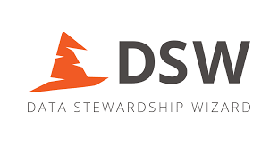

------------------------------------------------------------------------

 

------------------------------------------------------------------------

Resources supporting interoperability that were previously compiled in a Semantic Interoperability Profile (SIP) are incorporated into a standard FIP (version 5 and later) as supporting declarations, allowing streamlined and consistent management.  As a result, the SIP service will be maintained for six months (until 31 July 2026) to facilitate the transition to the standard FIP service. After this period, SIP-based management will be phased out. 

Please use the **[FIP Wizard](https://fip.fair-wizard.com/)** going forward. Detailed migration instructions will be provided soon.

If you have any questions, please do not hesitate to us at fipadmin@gofair.foundation.
